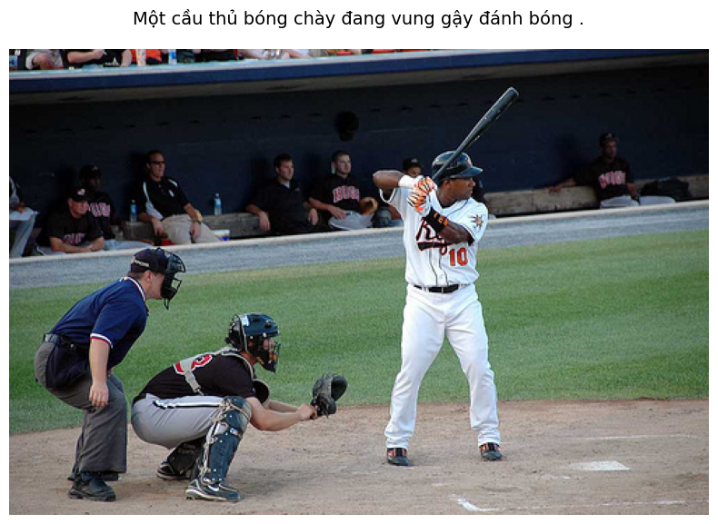

# Vietnamese Image Captioning with Vision Transformer 🇻🇳

**Vietnamese Image Captioning** is a Deep Learning project designed to build a model capable of automatically generating natural Vietnamese descriptions (captions) for input images.

The project leverages the robust feature extraction capabilities of **Vision Transformer (ViT)** combined with **LSTM** and **Attention**. Specifically, this model is engineered to address the **Low-Resource Image Captioning** challenge, utilizing a training dataset of only approximately 21,000 images.


## Dataset
Dataset Link: https://www.kaggle.com/datasets/easterharry/info-retrieval-v2

The model is trained on a consolidated dataset of approximately **21,000 images**, sourced from:
* **Flickr8k** (Vietnamese translated version).
* **UIT-ViIC** (UIT's Vietnamese Image Captioning dataset).
* **KTVIC**.

* **Vocabulary Size:** ~4,000 common Vietnamese words.
* **Tokenizer:** Word-level tokenization.

## Installation & Environment
1.  **Clone the repository:**
    ```bash
    git clone [https://github.com/DaoTuPhat/ViT-Transformer-Caption-VN.git](https://github.com/DaoTuPhat/ViT-Transformer-Caption-VN.git)
    cd ViT-Transformer-Caption-VN
    ```

2.  **Install dependencies:**
    ```bash
    pip install -r requirements.txt
    ```

3.  **Prepare Data:**
    Place your images in the `data/` directory and ensure the file paths in the configuration CSV are correct.


## Results
* **BLEU-1**: 0.6867
* **BLEU-2**: 0.5220
* **BLEU-3**: 0.3934
* **BLEU-4**: 0.2923
* **METEOR**: 0.4421
* **CIDEr** : 0.6863

